<p align="center">
  
</p>

<p align="center">
  
  <a href="https://www.python.org/downloads/"></a>
  <a href="https://modelcontextprotocol.io/"></a>
  
  <a href="LICENSE"></a>
</p>

<p align="center"><b>Run Cloudflare from a conversation.</b> An MCP server that lets Claude, or any MCP client, manage your zones, DNS records, cache and Workers KV through the Cloudflare API, in plain English.</p>

---

## ✨ Ask things like

> *"List my zones."*
> *"Point staging.example.com at 203.0.113.10, proxied, then purge the cache."*
> *"Which DNS records point at the old server?"*
> *"Purge just /assets/app.css."*
> *"How much traffic and how many threats did example.com see this week?"*
> *"Store `maintenance=true` in the `flags` KV namespace."*

## 🧰 13 tools, and the permissions they need

<p align="center">
  
</p>

| Group | Tools | Token permission |
|---|---|---|
| **Zones** | `list_zones`, `get_zone` | Zone · Zone · Read |
| **DNS** | `list_dns_records` (filter by type, name or content), `create_dns_record`, `update_dns_record`, `delete_dns_record` | Zone · DNS · Edit |
| **Workers KV** | `list_kv_namespaces`, `list_kv_keys`, `read_kv_value`, `write_kv_value`, `delete_kv_value` | Account · Workers KV Storage · Edit, plus `CLOUDFLARE_ACCOUNT_ID` |
| **Cache** | `purge_cache` (everything, or specific files, tags or hosts) | Zone · Cache Purge · Purge |
| **Analytics** | `get_zone_analytics` (requests, bandwidth, threats, pageviews) | Zone · Analytics · Read |

Seven tools only read. **Six change things:** creating, updating or deleting DNS records, purging the cache, and writing or deleting KV keys. A token without a permission can't use those tools, so grant only what you need.

## 🚀 Setup

**1. Create an API token.** In the Cloudflare dashboard, go to **My Profile → API Tokens → Create Token**. Start from the **Edit zone DNS** template, or build a custom token from the table above. Limit it to the zones you want the server to touch.

**2. Find your Account ID** (Workers KV only). It's on any zone's **Overview** page, in the right-hand column.

**3. Install.** You need **Python 3.10+** and [`uv`](https://github.com/astral-sh/uv).

```bash
git clone https://github.com/ry-ops/cloudflare-mcp-server
cd cloudflare-mcp-server
uv sync
```

**4. Connect Claude Desktop.** Add this to `claude_desktop_config.json`: `~/Library/Application Support/Claude/` on macOS, or `%APPDATA%\Claude\` on Windows.

```json
{
  "mcpServers": {
    "cloudflare": {
      "command": "uv",
      "args": ["--directory", "/absolute/path/to/cloudflare-mcp-server", "run", "cloudflare-mcp-server"],
      "env": {
        "CLOUDFLARE_API_TOKEN": "your_api_token",
        "CLOUDFLARE_ACCOUNT_ID": "your_account_id"
      }
    }
  }
}
```

The server reads **only environment variables**: `CLOUDFLARE_API_TOKEN` (required) and `CLOUDFLARE_ACCOUNT_ID` (for KV). Quit and reopen Claude Desktop to load it. There are more examples in [EXAMPLES.md](EXAMPLES.md), and a short walkthrough in [QUICKSTART.md](QUICKSTART.md).

## 🔒 Security

- **Scope the token** to specific zones and only the permissions you need. The **Edit zone DNS** template plus Zone Read is enough for most DNS work.
- **Keep your MCP client's tool approval on.** Deleting DNS records and purging cache take effect immediately.
- **Keep the token out of git.** Put it in your client's `env` block, or in a secrets manager.

## 🤝 Agent-to-agent (A2A)

[`agent-card.json`](agent-card.json) describes the server to other agents. It has five skills (zone management, DNS management, KV storage, cache management and analytics), and the **minimum** and **recommended** token permissions for each.

## 🩺 Troubleshooting

<details>
<summary><b>401 or 403 from Cloudflare</b></summary>

The token is wrong or is missing a permission for that tool. Check it against the table above, and that its zone resources include the zone you asked about.
</details>

<details>
<summary><b>KV tools fail but DNS works</b></summary>

Set `CLOUDFLARE_ACCOUNT_ID`, and give the token **Account · Workers KV Storage · Edit**.
</details>

<details>
<summary><b>"cloudflare" doesn't show up in Claude</b></summary>

Use an absolute path in `--directory`, run `uv sync` once in the project, check the JSON is valid, and quit Claude Desktop completely before reopening it.
</details>

## 🛠️ Development

```bash
uv sync
uv run cloudflare-mcp-server   # stdio server
```

All the code is in [`src/cloudflare_mcp_server/__init__.py`](src/cloudflare_mcp_server/__init__.py). See [CONTRIBUTING.md](CONTRIBUTING.md) and [CHANGELOG.md](CHANGELOG.md).

## License

MIT. See [LICENSE](LICENSE).

<!-- org-footer -->
---

<p align="center"><sub>Part of <a href="https://github.com/ry-ops">ry-ops</a> · building the pipes between infrastructure, automation, and observability · built by <a href="https://github.com/ry-ops">ry-ops</a></sub></p>
